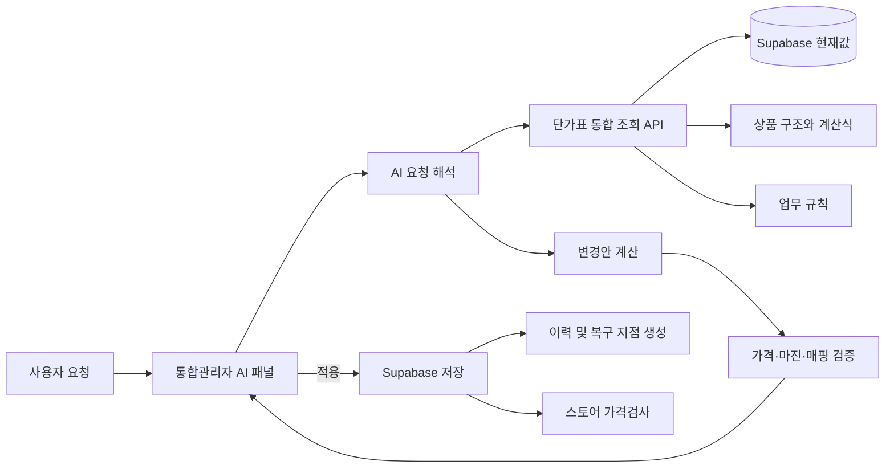

# 단가표 AI 시스템 구축 계획

> 작성일: 2026-09-22
> 대상: 통합관리자 페이지의 에너가드·한국단열 단가표 전체

## 1. 목표

통합관리자 페이지 안에 **단가표 전용 AI 패널**을 추가한다. 사용자가 평소 말하듯 요청하면 AI가 현재 단가표와 업무 규칙을 조회하고, 계산 근거와 변경 결과를 제시하며, 승인된 변경을 저장하고 후속 검증까지 수행한다.

예시 요청:

- `승현기업 타이거폼 공급원가를 200원씩 올리고 판매가도 같이 올려줘.`
- `PF보드 수입산 50T부터 100T까지 순수마진율이 낮은 상품을 찾아줘.`
- `아이소핑크 1호와 특호의 가격 간격이 이상한 두께만 보여줘.`
- `단가표와 스마트스토어 판매가가 다른 상품만 검사해줘.`
- `지난달보다 가격이 오른 부자재를 정리해줘.`
- `방금 변경하기 전 상태로 되돌려줘.`

## 2. 현재 단가표 범위

### 에너가드

- 아이소핑크
- 비드법단열재
- 경질우레탄
- PF보드
- 불연단열재
- 열반사단열재
- 접착식 단열벽지
- 이액형 PU폼
- 원가·마진·두께·규격별 판매가 계산
- 경쟁사 가격, 가상 판매가, 경쟁가 맞춤
- 가격 순서와 등급 관계 검증
- 단품·모음전 상품코드 매핑
- 확장프로그램을 이용한 실제 스토어 가격검사
- Supabase 저장 이력과 실제 적용가 관리

### 한국단열

- 현재 구현: 아이소핑크, 스티로폼, 부자재
- 확장 예정: 열반사단열재, 단열벽지, 창문형단열재, 기타단열재
- 기준 가격 → 배송 정책 → 몰별 실제 판매가 구조
- 판매 채널: 한국단열, 한국단열라이프, 홈페이지, 쿠팡, 쿠팡_부자재, ESM, 11번가
- 상품코드별 가격·배송·수정 전 값·가격 인상 이력
- Supabase 저장과 스냅샷 복원

현재 구조는 계산식, 상품코드, 저장 이력, 경쟁사 검사, 스토어 검사 기능을 이미 갖추고 있어 AI 구축 기반의 상당 부분이 마련되어 있다.

## 3. 사용자·AI·시스템 연결 구조



### 처리 흐름

1. 사용자가 단가표 AI 패널에 자연어로 요청한다.
2. AI가 회사, 카테고리, 업체, 상품, 두께, 규격, 상품코드와 변경 방식을 추출한다.
3. 통합 조회 API가 현재 원가·판매가·배송비·마진·경쟁가·몰별 가격을 반환한다.
4. AI가 대상 상품과 변경 결과를 계산한다.
5. 시스템이 마진 저하, 가격 역전, 코드 누락, 매핑 오류를 검증한다.
6. 화면에 대상과 변경 전후 값을 보여준다.
7. 사용자가 `적용`을 누르면 Supabase에 저장하고 복구용 스냅샷을 만든다.
8. 필요하면 확장프로그램 가격검사를 실행하여 스토어 반영 상태까지 확인한다.

## 4. AI에 제공할 전용 기능

AI가 HTML이나 JavaScript 원본을 직접 수정하는 방식 대신 다음과 같은 제한된 도구를 사용하게 한다.

| 기능 | 역할 |
|---|---|
| `search_products` | 회사·카테고리·업체·상품명·상품코드로 대상 검색 |
| `get_price_detail` | 원가, 판매가, 배송비, 마진, 경쟁가와 계산 근거 조회 |
| `simulate_change` | 실제 저장 없이 변경 전후 가격과 마진 계산 |
| `validate_prices` | 두께별 가격, 등급 관계, 마진 하한, 코드·매핑 검증 |
| `apply_change` | 검증된 변경안을 Supabase에 저장 |
| `run_store_price_check` | 확장프로그램으로 실제 스토어 판매가 검사 |
| `get_history` | 저장 및 가격 인상 이력 조회 |
| `restore_snapshot` | 선택한 저장 이력으로 복구 |

자연어 요청은 다음과 같은 구조화된 명령으로 변환한다.

```json
{
  "action": "increase_cost",
  "company": "한국단열",
  "category": "부자재",
  "supplier": "승현기업",
  "products": ["타이거폼"],
  "amount": 200,
  "salePricePolicy": "same_delta"
}
```

## 5. AI가 알아야 하는 정보

### 실시간 숫자와 상태

Supabase와 현재 화면 계산 엔진에서 조회한다.

- 원가와 적용 원가
- 기준 판매가와 실제 판매가
- 배송 정책과 배송비
- 수수료, 부가세, 마진, 순수마진율
- 경쟁사 가격과 가상 판매가
- 상품코드와 스토어 상품·옵션 매핑
- 몰별 현재 판매가와 수정 전 값
- 저장 이력과 실제 적용 상태

### 업무 규칙과 예외 이유

별도 `pricing_ai_rules` 테이블에 저장한다.

예시:

- 부자재 공급원가 인상은 기본적으로 판매가에도 같은 금액을 반영한다.
- 아이소핑크 단품 상품은 한 상품에 1호·특호가 함께 있어 상세페이지 검사가 필요하다.
- PF보드는 같은 종류에서 규격별 원가는 연결되지만 경쟁가에 맞춘 최종 마진은 달라질 수 있다.
- 스티로폼 상품코드의 `1800_900`과 `900_1800` 별칭은 같은 기준 코드로 조회한다.
- 가격이 없는 경쟁사 옵션은 가상 판매가로 보완할 수 있다.

업무 규칙에는 적용 범위, 우선순위, 작성 이유, 변경일을 함께 기록한다. AI는 숫자만 맞추는 것이 아니라 이 규칙을 바탕으로 변경 의도를 설명해야 한다.

## 6. 필요한 서버 구성

### 관리자 페이지

- 단가표 전용 AI 채팅창
- 현재 보고 있는 회사·카테고리·탭을 자동 문맥으로 전달
- 조회 결과, 계산 근거, 변경안 표 표시
- `변경안 미리보기`, `단가표에 적용`, `스토어 가격검사`, `변경 취소` 기능

### Supabase Edge Function

- OpenAI API 호출
- AI 도구 실행
- 현재 단가표 조회 및 변경
- 사용자 권한 확인
- 실행 기록 저장

OpenAI API 키는 브라우저 JavaScript에 넣지 않고 Supabase Edge Function의 서버 환경변수에 보관한다.

### 추가 테이블 예시

#### `pricing_ai_rules`

- 규칙 ID
- 회사와 카테고리
- 적용 대상
- 규칙 내용
- 우선순위
- 활성 여부
- 작성일과 수정일

#### `pricing_ai_actions`

- 사용자의 원문 요청
- AI가 해석한 구조화 명령
- 대상 상품 목록
- 변경 전후 값
- 검증 결과
- 적용 여부
- 저장 스냅샷 ID
- 실행 일시

## 7. 안전한 변경 원칙

- 질문과 조회는 바로 실행한다.
- 가격 변경 요청은 먼저 계산하고 대상과 전후 값을 표시한다.
- 실제 저장은 구조화된 명령과 허용된 API로만 수행한다.
- 저장 전에 가격 역전, 마진 하한, 상품코드 누락을 자동 검사한다.
- 한 번의 요청은 하나의 실행 이력으로 남긴다.
- 모든 적용 작업은 직전 스냅샷으로 복구할 수 있어야 한다.
- AI가 이해하지 못한 상품명이나 적용 범위만 사용자에게 짧게 확인한다.

## 8. 단계별 구축 순서

### 1단계: 통합 조회 계층

- 에너가드와 한국단열 데이터를 동일한 상품 구조로 변환한다.
- JavaScript에 정의된 상품 구조와 Supabase의 변경값을 합쳐 현재 상태를 반환한다.
- 상품코드 하나로 기준 가격, 배송 정책, 몰별 상품과 경쟁가를 추적할 수 있게 한다.

### 2단계: 읽기 전용 AI

- 상품과 가격 검색
- 계산 근거 설명
- 마진 및 가격 이상 탐지
- 경쟁사·스토어 가격 차이 요약
- 데이터는 변경하지 않는다.

### 3단계: 변경안 미리보기

- 공급원가, 마진, 배송비, 판매가 변경 시뮬레이션
- 대상 상품과 변경 전후 값 표시
- 연관 상품과 몰별 영향 범위 계산

### 4단계: 실제 변경 적용

- Supabase 저장
- 실행 기록과 복구 스냅샷 생성
- 기존 단가표 저장 이력과 연동

### 5단계: 스토어 후속 검증

- 확장프로그램 가격검사 실행
- 단가표와 다른 상품만 표시
- 반영 완료 여부와 미반영 상품 추적

## 9. 우선 구현 권장 범위

첫 버전은 다음 세 기능으로 제한한다.

1. `이 상품 가격이 왜 이렇게 계산됐어?`에 계산식과 근거로 답하기
2. 조건에 맞는 상품과 가격 이상을 찾아 표로 보여주기
3. 가격 변경 요청의 결과를 저장하지 않고 미리 계산하기

이 세 기능으로 AI의 상품 인식과 계산 정확도를 먼저 검증한 뒤 실제 저장 기능을 연결한다. 이후 스토어 가격검사와 자동 검증까지 확장한다.

## 10. 현재 구조에서 먼저 해결할 사항

현재 단가표는 **상품 구조와 기본값은 JavaScript**, **사용자가 저장한 변경값은 Supabase**에 있다. AI가 화면의 일부만 읽으면 실제 적용값이나 코드 기본값 중 하나를 놓칠 수 있다.

따라서 AI 개발의 첫 작업은 에너가드와 한국단열의 다음 정보를 합쳐 반환하는 `pricing context` 조회 기능이다.

- 코드에 정의된 상품 구조와 계산 규칙
- Supabase에 저장된 현재 적용값
- 경쟁사 가격과 상품 매핑
- 몰별 판매가와 배송 정책
- 저장 이력과 업무 규칙

이 통합 조회 계층이 완성되면 새로운 상품이나 채널이 추가되어도 AI가 동일한 방식으로 조회하고 변경할 수 있다.
