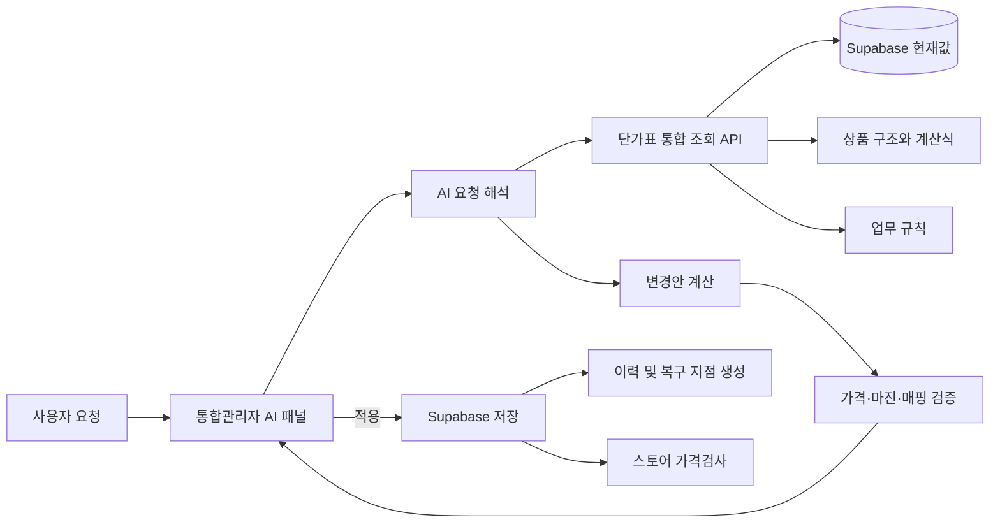
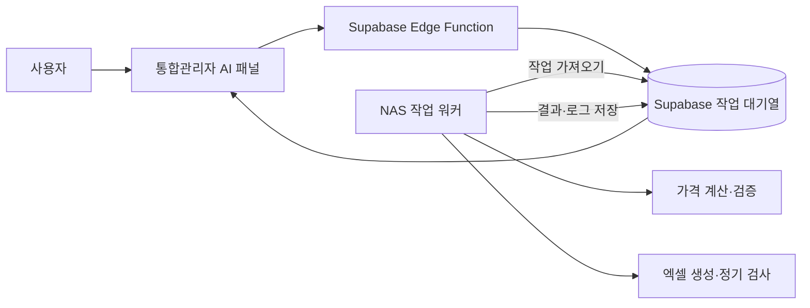
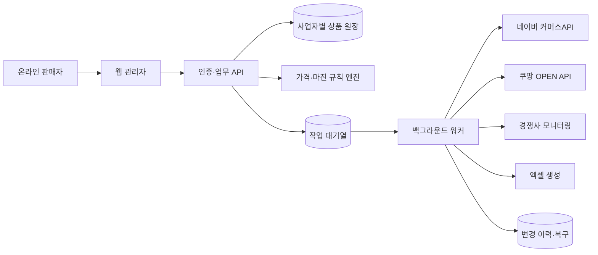

# 단가표 AI 시스템 구축 계획

> 작성일: 2026-09-22
> 대상: 통합관리자 페이지의 에너가드·한국단열 단가표 전체

## 1. 목표

통합관리자 페이지 안에 **단가표 전용 AI 패널**을 추가한다. 사용자가 평소 말하듯 요청하면 AI가 현재 단가표와 업무 규칙을 조회하고, 계산 근거와 변경 결과를 제시하며, 승인된 변경을 저장하고 후속 검증까지 수행한다.

예시 요청:

- `승현기업 타이거폼 공급원가를 200원씩 올리고 판매가도 같이 올려줘.`
- `PF보드 수입산 50T부터 100T까지 순수마진율이 낮은 상품을 찾아줘.`
- `아이소핑크 1호와 특호의 가격 간격이 이상한 두께만 보여줘.`
- `단가표와 스마트스토어 판매가가 다른 상품만 검사해줘.`
- `지난달보다 가격이 오른 부자재를 정리해줘.`
- `방금 변경하기 전 상태로 되돌려줘.`

## 2. 현재 단가표 범위

### 에너가드

- 아이소핑크
- 비드법단열재
- 경질우레탄
- PF보드
- 불연단열재
- 열반사단열재
- 접착식 단열벽지
- 이액형 PU폼
- 원가·마진·두께·규격별 판매가 계산
- 경쟁사 가격, 가상 판매가, 경쟁가 맞춤
- 가격 순서와 등급 관계 검증
- 단품·모음전 상품코드 매핑
- 확장프로그램을 이용한 실제 스토어 가격검사
- Supabase 저장 이력과 실제 적용가 관리

### 한국단열

- 현재 구현: 아이소핑크, 스티로폼, 부자재
- 확장 예정: 열반사단열재, 단열벽지, 창문형단열재, 기타단열재
- 기준 가격 → 배송 정책 → 몰별 실제 판매가 구조
- 판매 채널: 한국단열, 한국단열라이프, 홈페이지, 쿠팡, 쿠팡_부자재, ESM, 11번가
- 상품코드별 가격·배송·수정 전 값·가격 인상 이력
- Supabase 저장과 스냅샷 복원

현재 구조는 계산식, 상품코드, 저장 이력, 경쟁사 검사, 스토어 검사 기능을 이미 갖추고 있어 AI 구축 기반의 상당 부분이 마련되어 있다.

## 3. 사용자·AI·시스템 연결 구조



### 처리 흐름

1. 사용자가 단가표 AI 패널에 자연어로 요청한다.
2. AI가 회사, 카테고리, 업체, 상품, 두께, 규격, 상품코드와 변경 방식을 추출한다.
3. 통합 조회 API가 현재 원가·판매가·배송비·마진·경쟁가·몰별 가격을 반환한다.
4. AI가 대상 상품과 변경 결과를 계산한다.
5. 시스템이 마진 저하, 가격 역전, 코드 누락, 매핑 오류를 검증한다.
6. 화면에 대상과 변경 전후 값을 보여준다.
7. 사용자가 `적용`을 누르면 Supabase에 저장하고 복구용 스냅샷을 만든다.
8. 필요하면 확장프로그램 가격검사를 실행하여 스토어 반영 상태까지 확인한다.

## 4. AI에 제공할 전용 기능

AI가 HTML이나 JavaScript 원본을 직접 수정하는 방식 대신 다음과 같은 제한된 도구를 사용하게 한다.

| 기능 | 역할 |
|---|---|
| `search_products` | 회사·카테고리·업체·상품명·상품코드로 대상 검색 |
| `get_price_detail` | 원가, 판매가, 배송비, 마진, 경쟁가와 계산 근거 조회 |
| `simulate_change` | 실제 저장 없이 변경 전후 가격과 마진 계산 |
| `validate_prices` | 두께별 가격, 등급 관계, 마진 하한, 코드·매핑 검증 |
| `apply_change` | 검증된 변경안을 Supabase에 저장 |
| `run_store_price_check` | 확장프로그램으로 실제 스토어 판매가 검사 |
| `get_history` | 저장 및 가격 인상 이력 조회 |
| `restore_snapshot` | 선택한 저장 이력으로 복구 |

자연어 요청은 다음과 같은 구조화된 명령으로 변환한다.

```json
{
  "action": "increase_cost",
  "company": "한국단열",
  "category": "부자재",
  "supplier": "승현기업",
  "products": ["타이거폼"],
  "amount": 200,
  "salePricePolicy": "same_delta"
}
```

## 5. AI가 알아야 하는 정보

### 실시간 숫자와 상태

Supabase와 현재 화면 계산 엔진에서 조회한다.

- 원가와 적용 원가
- 기준 판매가와 실제 판매가
- 배송 정책과 배송비
- 수수료, 부가세, 마진, 순수마진율
- 경쟁사 가격과 가상 판매가
- 상품코드와 스토어 상품·옵션 매핑
- 몰별 현재 판매가와 수정 전 값
- 저장 이력과 실제 적용 상태

### 업무 규칙과 예외 이유

별도 `pricing_ai_rules` 테이블에 저장한다.

예시:

- 부자재 공급원가 인상은 기본적으로 판매가에도 같은 금액을 반영한다.
- 아이소핑크 단품 상품은 한 상품에 1호·특호가 함께 있어 상세페이지 검사가 필요하다.
- PF보드는 같은 종류에서 규격별 원가는 연결되지만 경쟁가에 맞춘 최종 마진은 달라질 수 있다.
- 스티로폼 상품코드의 `1800_900`과 `900_1800` 별칭은 같은 기준 코드로 조회한다.
- 가격이 없는 경쟁사 옵션은 가상 판매가로 보완할 수 있다.

업무 규칙에는 적용 범위, 우선순위, 작성 이유, 변경일을 함께 기록한다. AI는 숫자만 맞추는 것이 아니라 이 규칙을 바탕으로 변경 의도를 설명해야 한다.

## 6. 필요한 서버 구성

### 관리자 페이지

- 단가표 전용 AI 채팅창
- 현재 보고 있는 회사·카테고리·탭을 자동 문맥으로 전달
- 조회 결과, 계산 근거, 변경안 표 표시
- `변경안 미리보기`, `단가표에 적용`, `스토어 가격검사`, `변경 취소` 기능

### Supabase Edge Function

- OpenAI API 호출
- AI 도구 실행
- 현재 단가표 조회 및 변경
- 사용자 권한 확인
- 실행 기록 저장

OpenAI API 키는 브라우저 JavaScript에 넣지 않고 Supabase Edge Function의 서버 환경변수에 보관한다.

### 추가 테이블 예시

#### `pricing_ai_rules`

- 규칙 ID
- 회사와 카테고리
- 적용 대상
- 규칙 내용
- 우선순위
- 활성 여부
- 작성일과 수정일

#### `pricing_ai_actions`

- 사용자의 원문 요청
- AI가 해석한 구조화 명령
- 대상 상품 목록
- 변경 전후 값
- 검증 결과
- 적용 여부
- 저장 스냅샷 ID
- 실행 일시

## 7. 안전한 변경 원칙

- 질문과 조회는 바로 실행한다.
- 가격 변경 요청은 먼저 계산하고 대상과 전후 값을 표시한다.
- 실제 저장은 구조화된 명령과 허용된 API로만 수행한다.
- 저장 전에 가격 역전, 마진 하한, 상품코드 누락을 자동 검사한다.
- 한 번의 요청은 하나의 실행 이력으로 남긴다.
- 모든 적용 작업은 직전 스냅샷으로 복구할 수 있어야 한다.
- AI가 이해하지 못한 상품명이나 적용 범위만 사용자에게 짧게 확인한다.

## 8. 단계별 구축 순서

### 1단계: 통합 조회 계층

- 에너가드와 한국단열 데이터를 동일한 상품 구조로 변환한다.
- JavaScript에 정의된 상품 구조와 Supabase의 변경값을 합쳐 현재 상태를 반환한다.
- 상품코드 하나로 기준 가격, 배송 정책, 몰별 상품과 경쟁가를 추적할 수 있게 한다.

### 2단계: 읽기 전용 AI

- 상품과 가격 검색
- 계산 근거 설명
- 마진 및 가격 이상 탐지
- 경쟁사·스토어 가격 차이 요약
- 데이터는 변경하지 않는다.

### 3단계: 변경안 미리보기

- 공급원가, 마진, 배송비, 판매가 변경 시뮬레이션
- 대상 상품과 변경 전후 값 표시
- 연관 상품과 몰별 영향 범위 계산

### 4단계: 실제 변경 적용

- Supabase 저장
- 실행 기록과 복구 스냅샷 생성
- 기존 단가표 저장 이력과 연동

### 5단계: 스토어 후속 검증

- 확장프로그램 가격검사 실행
- 단가표와 다른 상품만 표시
- 반영 완료 여부와 미반영 상품 추적

## 9. 우선 구현 권장 범위

첫 버전은 다음 세 기능으로 제한한다.

1. `이 상품 가격이 왜 이렇게 계산됐어?`에 계산식과 근거로 답하기
2. 조건에 맞는 상품과 가격 이상을 찾아 표로 보여주기
3. 가격 변경 요청의 결과를 저장하지 않고 미리 계산하기

이 세 기능으로 AI의 상품 인식과 계산 정확도를 먼저 검증한 뒤 실제 저장 기능을 연결한다. 이후 스토어 가격검사와 자동 검증까지 확장한다.

## 9-1. 궁극 목표 시나리오 (2026-09-22 사용자 구상, 지금 당장 착수 대상 아님)

사용자가 최종적으로 원하는 사용 방식을 메모해 둔다. "지금 당장 할 일"이 아니라 **잊지 않기 위한 기록**이고, 나중에 우선순위를 다시 볼 때 참고한다.

> 우레탄폼 가격이 전체적으로 다 올랐어, +100원씩 인상하고 각 채널에 모두 반영해줘. 반영했으면 가격검증해줘. 엑셀 수정이 필요하니까 수정할 엑셀파일 채널마다 만들어줘. (나중에 쇼핑 API까지 연동되면) 자동으로 스마트스토어나 쿠팡에 반영해줘.
>
> ****코드 상품이 이제 판매중단이야, 단가표에 반영해줘. 반영됐는지 검증하고, 쇼핑 API 연결되면 자동으로 각 채널에 반영해줘.
>
> 경쟁사 아이소핑크 단가가 바뀌었는지 확인해줘. 바뀌었으면 자동으로 경쟁사 가격에 맞게 우리 가격도 조정해줘.

이유: 지금 단가표가 회사·카테고리·채널·상품코드로 잘게 나뉘어 있어서, 사람이 직접 하나씩 고치려면 복잡하고 실수하기 쉽다. "우레탄폼 전체" 같은 업무 언어 한마디로 대상 상품을 찾아 일괄 변경·전파·검증까지 끝내고 싶다는 것이 핵심 동기다.

### 시나리오별 실현 가능성 점검 (Claude, 2026-09-22)

이 저장소의 실제 코드를 기준으로 조각별 난이도를 나눠본다.

1. **"우레탄폼 전체 +100원, 채널 반영, 검증" — 지금 구조로 대부분 됨.**
   - "우레탄폼"이라는 자연어가 바로 상품명에 들어 있다(한국단열 부자재 `T_B1_G`·`T_B1_G_B`·`T_B2_G`·`T_B2_G_B`·`T_BIG65_G` = 우레탄폼-B1/B1-박스/B2/B2-박스/빅-65). `search_products`가 상품명 부분일치만 해도 대상을 찾을 수 있다. 단, 에너가드에도 "경질우레탄" 카테고리가 있어 "우레탄폼"이 어느 회사를 가리키는지 모호할 수 있다 — AI가 되물어야 하는 경우(계획서 7장 원칙에 이미 있음).
   - 가격 변경 자체는 부자재 화면의 "공급원가 조정액 +100 적용"과 동일 동작(가격 인상 이력에 자동 기록됨, 2026-09-22 구현).
   - 채널 반영은 별도 동작이 필요 없다 — 채널 화면은 상품코드로 1단계 값을 실시간 조회하므로(`_hkChannelTargetPrice`) 1단계를 저장하는 순간 모든 채널에 자동 반영된다.
   - 검증도 이미 있다 — 채널 헤드의 "반영 대기 N" 배지를 읽으면 된다.
   - → **새로 만들 것은 "업무 언어 → 상품코드 목록" 검색뿐**이고, 나머지는 4단계(실제 변경 적용)만 완성되면 그대로 된다.

2. **"채널마다 수정할 엑셀 만들어줘" — 계획서에 없던 기능, 새로 추가해야 함(난이도 낮음).**
   - 반영 대기 옵션(상품코드·현재 판매가·수정 전 판매가·차액)은 이미 화면에서 계산돼 있어서, 채널별 업로드 양식으로 xlsx를 뽑는 도구(`export_channel_excel`) 하나만 추가하면 된다. 4장 도구 목록에 넣을 항목.

3. **"쇼핑 API 연동되면 자동 반영" — 별도 프로젝트급, 계획서 5단계보다 한 단계 더 나간 "스토어 후속 반영".**
   - 네이버 커머스 API·쿠팡 Wing Open API 모두 가격·재고·판매상태 수정 엔드포인트가 있어 기술적으로는 가능하다.
   - 다만 마켓마다 인증·앱 등록·승인 절차가 다르고, 우리 상품코드 ↔ 마켓 옵션ID 매핑을 정확히 관리해야 하며(쿠팡 옵션ID는 이미 다루고 있어 기반은 있음), 잘못 반영됐을 때 되돌리는 수단까지 갖춰야 안전하다.
   - → "엑셀 수동 업로드(2번) → 나중에 API 자동화"로 가는 단계 구분이 이미 맞는 방향이다. 당장 할 일 아님.

4. **"특정 코드 판매중단으로 반영해줘" — 이미 거의 다 있는 기능, 1번보다도 쉬움.**
   - `hkChannelSetStatus`로 옵션 판매상태(품절/판매중지)를 바꾸는 기능, 재고 0 처리, 반영 대기 제외까지 이미 구현돼 있다(2026-09-21). AI가 할 일은 "이 코드를 가진 모든 채널의 모든 옵션을 찾아 상태를 바꾸고 저장"뿐.

5. **"경쟁사 아이소핑크 단가 변경 감지 → 자동 가격 조정" — 가장 새로 만들어야 하는 부분.**
   - 에너가드 쪽엔 "경쟁사 가격·가상 판매가" 기능이 있다고 알려져 있으나(계획서 2장), "예전 값과 비교해 바뀌었는지 자동 감지"까지 되는지는 별도 확인 필요. 한국단열 쪽은 이번 세션에 확인한 코드 어디에도 경쟁사 관련 로직이 없었다.
   - 필요한 것 3가지: ① 경쟁사 가격을 주기적으로 가져오는 수단(스크래핑 또는 API — "스토어 가격검사"와 성격이 비슷한 문제), ② 지난 값과 비교하기 위한 스냅샷/이력 저장(감지는 이력 없이 불가능), ③ **"경쟁가에 맞춰 우리 가격을 어떻게 바꿀지"의 판단 규칙**(똑같이 맞출지, 얼마 낮출지, 마진 하한선은 지킬지 — 코드가 정할 게 아니라 사람이 정책으로 정해야 함, 5장의 `pricing_ai_rules` 테이블이 정확히 이 용도).
   - → 당장 할 일 아님. 나중에 규칙(③)부터 사람이 정하고 시작하는 게 순서.

### 종합

1번·4번은 지금 구조로 거의 바로 가능, 2번은 새 도구 하나만 추가하면 됨, 3번·5번은 각각 별도 프로젝트급(마켓 API 연동, 경쟁사 가격 수집·정책)이다. 우선순위를 다시 잡을 때는 1번·4번(즉시 가능) → 2번(도구 하나 추가) → 3번·5번(별도 프로젝트, 사람이 먼저 정책 정의) 순서를 권한다.

## 9-2. 자체 서버/NAS를 이용한 원격 작업 구상 (장기 선택사항)

NAS는 단가표 AI 때문에 당장 구축하는 필수 장비가 아니다. 다른 용도로 NAS나 상시 서버를 구축하게 되면 그때 단가표 시스템의 **원격 작업 워커**를 함께 올리는 방향으로 검토한다. 현재 우선순위는 9장의 읽기 전용 기능이며, NAS 구축 여부와 관계없이 먼저 진행할 수 있다.

### NAS가 생기면 맡길 수 있는 역할

- Node.js에서 단가 계산·검증 작업 실행
- 정기적인 스토어 가격검사와 경쟁사 가격 수집
- 채널별 수정용 엑셀 생성 및 보관
- 오래 걸리는 전체 상품 검사와 실패 작업 재시도
- 변경 전 스냅샷과 작업 로그 백업
- 네이버·쿠팡 등 외부 API 연결을 위한 비밀키·세션 관리

### 기존 계산 코드를 재사용하는 방법

현재 계산 함수 일부는 브라우저 DOM과 연결되어 있어 Supabase Edge Function에서 그대로 실행하기 어렵다. NAS의 Node.js 환경에서는 다음 두 방식을 선택할 수 있다.

1. **단기 방식 — 실행 도구(harness) 사용**
   - jsdom 또는 Playwright로 브라우저 실행 환경을 만들고 `pricing-hankook.js`, `pricing-hankook-bead.js` 등 현재 파일을 불러온다.
   - `document.getElementById`, `showToast` 같은 화면 전용 호출이 계산 실행을 막지 않도록 최소한의 가짜 화면 요소와 함수를 제공한다.
   - 웹 화면과 서버가 같은 계산 파일을 사용하므로 계산식이 서로 어긋날 가능성을 줄일 수 있다.

2. **장기 방식 — 공통 계산 코어 분리**
   - 가격·마진·배송 계산을 DOM이 없는 순수 함수 모듈로 분리한다.
   - 관리자 페이지, Edge Function, NAS 워커가 같은 계산 모듈을 사용한다.
   - 초기 작업량은 더 크지만 테스트·유지보수·안정성 측면에서는 최종적으로 이 구조가 낫다.

jsdom 방식은 기존 코드를 빠르게 재사용하는 방법이지 DOM 결합 문제 자체를 제거하는 것은 아니다. NAS를 실제 운영하기 전까지는 필요한 계산식만 순수 함수로 작게 분리하고, 서버 구축 시점에 공통 계산 코어의 범위를 다시 결정한다.

### 원격 지시 연결 방식

NAS 관리 포트를 인터넷에 직접 공개하지 않는 것을 기본 원칙으로 한다. 권장 흐름은 다음과 같다.



1. 사용자가 관리자 페이지에서 작업을 지시한다.
2. Edge Function이 사용자 권한과 요청 내용을 확인한 뒤 `pricing_ai_jobs` 대기열에 작업을 기록한다.
3. NAS 워커가 Supabase Realtime 또는 주기적 조회로 대기 작업을 가져간다.
4. NAS가 계산·검사·엑셀 생성을 실행하고 결과와 로그를 Supabase에 저장한다.
5. 관리자 페이지가 결과를 표시하고, 실제 가격 변경이 필요한 작업은 사용자의 적용 절차를 거친다.

이 방식은 NAS가 외부 요청을 직접 받지 않고 스스로 작업을 가져가기 때문에 공유기 포트포워딩이 필요 없다. 실시간 응답이 꼭 필요하다면 Cloudflare Tunnel 같은 관리형 터널과 서명된 전용 API를 사용할 수 있지만, 단가표 자동 작업은 대기열 방식이 더 단순하고 안전하다.

### NAS 도입 전과 도입 후의 역할 분리

| 구분 | NAS 도입 전 | NAS 도입 후 |
|---|---|---|
| AI 대화·사용자 인증 | Supabase Edge Function | Supabase Edge Function 유지 |
| 단순 조회·설명 | Edge Function과 통합 조회 API | 동일 |
| 변경 시뮬레이션 | 필요한 계산식을 순수 함수로 실행 | 공통 계산 코어 또는 NAS 실행 도구 사용 |
| 장시간 전체 검사 | 사용자 브라우저·확장프로그램 | NAS 워커 |
| 예약 검사·재시도 | 제한적 | NAS 워커 |
| 엑셀 생성 | Edge Function 또는 브라우저 | NAS에서 생성·보관 가능 |
| 실제 마켓 반영 | 수동 업로드 | API 승인 후 NAS 워커로 확장 가능 |

### 운영 시 주의사항

- OpenAI·네이버·쿠팡 API 키와 로그인 세션을 브라우저 코드나 저장소에 넣지 않는다.
- 단가표용 컨테이너와 NAS의 개인 파일 영역을 분리하고 최소 권한만 부여한다.
- 외부 작업은 요청 서명, 만료시간, 중복 실행 방지 키를 검증한다.
- 가격 변경은 작업 생성과 실제 적용을 분리하고, 적용 전후 스냅샷을 남긴다.
- NAS 중단 시 작업을 잃지 않도록 대기·실행·완료·실패 상태를 Supabase에 기록한다.
- 스토어 스크래핑은 로그인 세션 보안, 페이지 구조 변경, 요청 차단 가능성을 별도 프로젝트로 관리한다.

### 현재 결정

- NAS는 별도 장기 계획이며 단가표 AI 때문에 구축을 앞당기지 않는다.
- 당장은 AI에 모든 작업을 위임하지 않고 조회·설명·이상 탐지·변경 시뮬레이션부터 시작한다.
- NAS가 생기면 장시간 검사와 예약 작업부터 이전하고, 실제 가격 변경은 충분한 검증과 복구 체계를 만든 뒤 연결한다.

## 9-3. 온라인 판매자용 상업화 구상 (장기 아이디어)

현재 시스템을 회사 내부 단가표에서 확장하면 온라인 쇼핑몰 운영자를 위한 **마진 중심 상품·가격 운영 서비스**로 상업화할 수 있다. 단순 상품등록 도구보다, 상품 원가와 배송비를 기준으로 적정 판매가를 계산하고 여러 판매 채널에 전파·검증하는 운영 시스템에 가깝다.

### 해결하려는 문제

온라인 판매자는 다음 작업을 엑셀, 쇼핑몰 관리자, 별도 재고 프로그램에서 반복한다.

- 상품마다 제각각인 상품코드 작성과 관리
- 원가·수수료·부가세·배송비를 고려한 실제 마진 계산
- 목표 마진에 맞는 판매가 결정
- 스마트스토어·쿠팡 등 여러 채널의 가격과 재고를 각각 수정
- 옵션상품의 기준가와 옵션추가금 계산
- 공급가 인상 후 관련 상품 전체 가격 변경
- 경쟁사 가격 변화 확인과 대응
- 판매중단·품절 상품을 모든 채널에서 찾아 수정
- 엑셀 상품 목록을 쇼핑몰 등록 형식으로 다시 가공

서비스는 이 과정을 하나의 상품 원장과 규칙 엔진으로 묶어 반복 작업과 가격 실수를 줄이는 것이 핵심 가치다.

### 주요 기능 구상

1. **상품 원장과 자동 상품코드**
   - 업체·브랜드·품목·규격·옵션을 조합한 코드 규칙 설정
   - 신규 상품과 옵션에 중복되지 않는 코드 자동 부여
   - 기존 사용자 코드를 유지하면서 내부 통합코드와 연결

2. **원가·마진 계산과 판매가 추천**
   - 공급원가, 가공비, 포장비, 배송비, 채널 수수료, 부가세 반영
   - 목표 순수마진율 또는 목표 마진액에 맞는 판매가 추천
   - 가격 단위 올림, 최소 마진, 최저·최고 가격 같은 사업자별 규칙
   - 기준가·옵션추가금·묶음수량·무료배송 가격 자동 계산

3. **엑셀 가져오기와 내보내기**
   - 사용자의 기존 엑셀 열을 상품명·원가·코드·재고 등에 연결하는 가져오기 도구
   - 중복 코드, 빠진 필수값, 숫자 형식과 옵션 관계 사전 검증
   - 실제 저장 전 미리보기와 오류 행만 다시 내려받기
   - 스마트스토어·쿠팡 등 채널별 수정용 엑셀 생성

4. **멀티채널 상품 연결**
   - 하나의 내부 상품코드를 각 채널 상품번호·옵션번호와 연결
   - 채널별 수수료·배송·쿠폰·가격 단위 규칙 적용
   - 내부 권장 판매가와 실제 몰 판매가 차이 표시
   - 상품 연결이 끊겼거나 옵션이 누락된 항목 탐지

5. **가격·재고·판매상태 관리**
   - 원가 인상액을 관련 상품과 채널에 일괄 반영
   - 재고 연동, 안전재고, 품절·판매중지 처리
   - 적용 전 변경 대상과 전후 값을 표시하고 사용자 승인 후 실행
   - 부분 실패 시 성공·실패 상품을 나누고 재시도
   - 모든 변경의 실행자·시간·전후 값과 복구 스냅샷 보관

6. **경쟁사 모니터링과 가격 정책**
   - 사용자가 지정한 경쟁 상품의 가격 변화 기록
   - 최저가, 배송비 포함가, 옵션별 실질 가격 비교
   - 경쟁가보다 일정 금액 또는 비율로 조정하는 규칙
   - 최소 마진·최저 판매가를 침범하면 자동 변경하지 않고 경고
   - 완전 자동화보다 알림 → 변경안 추천 → 승인 적용 순서로 시작

7. **AI 운영 보조**
   - `A업체 공급가가 200원 올랐으니 관련 상품 가격을 다시 계산해줘` 같은 자연어 요청
   - 계산 근거와 영향을 받는 상품·채널 설명
   - 가격 역전, 낮은 마진, 누락 매핑, 비정상 재고 탐지
   - 사용자가 승인한 구조화된 작업만 실행

### 권장 제품 형태

초기 제품은 모든 기능을 갖춘 쇼핑몰 ERP가 아니라 다음 문장으로 설명할 수 있는 범위가 적절하다.

> 원가와 목표 마진을 관리하면 스마트스토어·쿠팡의 상품 가격과 재고를 안전하게 맞춰주는 서비스

주요 고객은 상품 수와 옵션이 많고 공급가·배송비 변동이 잦지만 자체 개발 인력이 없는 소규모·중형 온라인 판매자다. 특히 건축자재처럼 규격·두께·수량에 따라 가격과 배송비가 복잡한 업종에서 먼저 검증한 뒤 다른 업종으로 확장할 수 있다.

### 내부 시스템을 상용 제품으로 바꿀 때 필요한 변화

현재 코드는 에너가드·한국단열의 상품명, 계산 규칙과 예외가 JavaScript에 직접 들어 있다. 상용 서비스에서는 이를 다음 구조로 일반화해야 한다.

- 회사별 데이터가 섞이지 않는 사업자(tenant) 분리
- 사용자·역할·승인 권한과 작업 감사 로그
- 코드에 박힌 규칙을 화면에서 설정 가능한 가격 정책으로 변환
- 상품, 옵션, 원가, 채널 매핑을 공통 데이터 모델로 통합
- 채널 인증정보 암호화와 사업자별 연결 해제 기능
- API 호출 제한, 만료된 인증, 부분 실패와 재처리 관리
- 업종별 템플릿과 사용자 정의 열·계산식 지원
- 사용자가 탈퇴하거나 연결을 끊을 때 데이터 내보내기와 삭제 절차

AI 자체보다 **상품코드 매핑, 업종별 가격 규칙, 안전한 변경 이력, 채널별 오류 처리 경험**이 경쟁력이 된다. 이 데이터와 운영 노하우가 쌓일수록 다른 가격관리 도구가 따라오기 어려워진다.

### 단계별 상업화 순서

#### 0단계: 내부 실사용 검증

- 현재 에너가드·한국단열에서 가격 계산과 채널 검증을 실제로 사용
- 계산 오류와 예외 사례를 축적하고 공통 규칙과 회사 전용 규칙을 분리
- 변경 이력과 복구가 실제 업무에서 충분한지 확인

#### 1단계: 읽기 전용 마진 관리 서비스

- 엑셀 상품 가져오기
- 자동 상품코드 부여
- 원가·수수료·배송비 기반 마진 계산
- 목표 마진 판매가 추천
- 실제 쇼핑몰 가격은 변경하지 않고 보고서와 수정용 엑셀만 제공

#### 2단계: 채널 연결과 변경안 생성

- 스마트스토어·쿠팡 상품과 내부 상품코드 연결
- 현재 가격·재고 조회와 불일치 검증
- 채널별 수정용 엑셀 생성
- 사용자가 쇼핑몰 관리자에서 직접 반영

#### 3단계: 승인형 API 반영

- 사용자가 변경안을 검토하고 승인하면 가격·재고·판매상태를 API로 반영
- 일괄 작업의 일부가 실패하면 자동 중단하거나 성공분을 명확히 분리
- 적용 결과 재조회와 자동 검증

#### 4단계: 경쟁사 모니터링과 제한적 자동화

- 경쟁사 가격 변화 알림
- 정책에 따른 변경안 자동 작성
- 최소 마진과 가격 범위를 통과한 작업만 승인 대상으로 제시
- 충분한 사용 이력이 쌓인 정책만 선택적으로 자동 적용

### 과금 구상

정확한 금액은 시장조사 후 정하되, 다음 사용량을 기준으로 월 구독제를 구성할 수 있다.

- 관리 상품·옵션 수
- 연결한 쇼핑몰 채널 수
- 가격·재고 검사 주기와 월 실행 횟수
- 사용자 계정과 승인 단계 수
- 경쟁사 모니터링 상품 수
- API 자동 반영과 작업 이력 보관 기간

무료 또는 저가 요금제는 엑셀 가져오기·마진 계산·판매가 추천까지만 제공하고, 채널 연결·자동 검사·API 반영을 상위 요금제로 분리할 수 있다. 초기에는 월 구독 외에 복잡한 엑셀 정리와 상품 매핑을 위한 도입 지원 비용도 현실적인 수익원이 될 수 있다.

### 기술 구조



초기에는 Supabase 인증·DB·Edge Function을 사용하고 장시간 작업은 별도 워커나 NAS/VPS에서 처리할 수 있다. 서비스가 커지면 작업 대기열, 채널 커넥터와 계산 엔진을 독립 서비스로 분리한다.

### 기술적으로 가능한 범위와 주의점

- 네이버 커머스API는 상품 등록·수정, 멀티 상품 변경, 옵션 가격·재고 변경과 판매상태 변경 기능을 제공한다.
- 쿠팡 OPEN API도 상품 등록·수정과 판매 승인 흐름을 제공하지만 계정·상품 상태와 승인 조건을 고려해야 한다.
- 각 판매자가 API 애플리케이션 권한과 채널 연결 절차를 완료해야 하며, 플랫폼별 정책과 호출 제한에 맞춰야 한다.
- 경쟁사 수집은 공개 API 제공 범위가 제한될 수 있어 플랫폼 약관, 수집 허용 범위와 차단 가능성을 별도로 검토해야 한다.
- 자동 가격 변경은 가격 경쟁의 연쇄 반응과 손실 위험이 있으므로 최소 마진·최저가·하루 변경 횟수·최대 변동폭을 필수 안전장치로 둔다.

참고 공식 문서:

- [네이버 커머스API 상품](https://apicenter.commerce.naver.com/docs/commerce-api/current/%EC%83%81%ED%92%88)
- [네이버 커머스API 소개](https://apicenter.commerce.naver.com/ko/assets/apidocs/openapi-doc.html)
- [쿠팡 OPEN API 상품 승인 요청](https://developers.coupangcorp.com/hc/en-us/articles/360033644894)

### 현재 판단

- 상업화 가능성은 충분하지만, 먼저 내부 시스템을 실제로 사용하면서 예외와 안전장치를 축적해야 한다.
- 첫 판매 제품은 자동 가격 변경 서비스보다 엑셀 기반 상품 원장·마진 계산·판매가 추천 도구가 적절하다.
- 채널 API 자동 반영은 고객 데이터 분리, 권한 관리, 감사 로그와 복구 체계가 완성된 이후 제공한다.
- 범용 서비스를 처음부터 만들기보다 현재 강점이 있는 복잡한 규격·배송비 상품군에서 시작해 제품성을 검증한다.

## 10. 현재 구조에서 먼저 해결할 사항

현재 단가표는 **상품 구조와 기본값은 JavaScript**, **사용자가 저장한 변경값은 Supabase**에 있다. AI가 화면의 일부만 읽으면 실제 적용값이나 코드 기본값 중 하나를 놓칠 수 있다.

따라서 AI 개발의 첫 작업은 에너가드와 한국단열의 다음 정보를 합쳐 반환하는 `pricing context` 조회 기능이다.

- 코드에 정의된 상품 구조와 계산 규칙
- Supabase에 저장된 현재 적용값
- 경쟁사 가격과 상품 매핑
- 몰별 판매가와 배송 정책
- 저장 이력과 업무 규칙

이 통합 조회 계층이 완성되면 새로운 상품이나 채널이 추가되어도 AI가 동일한 방식으로 조회하고 변경할 수 있다.
